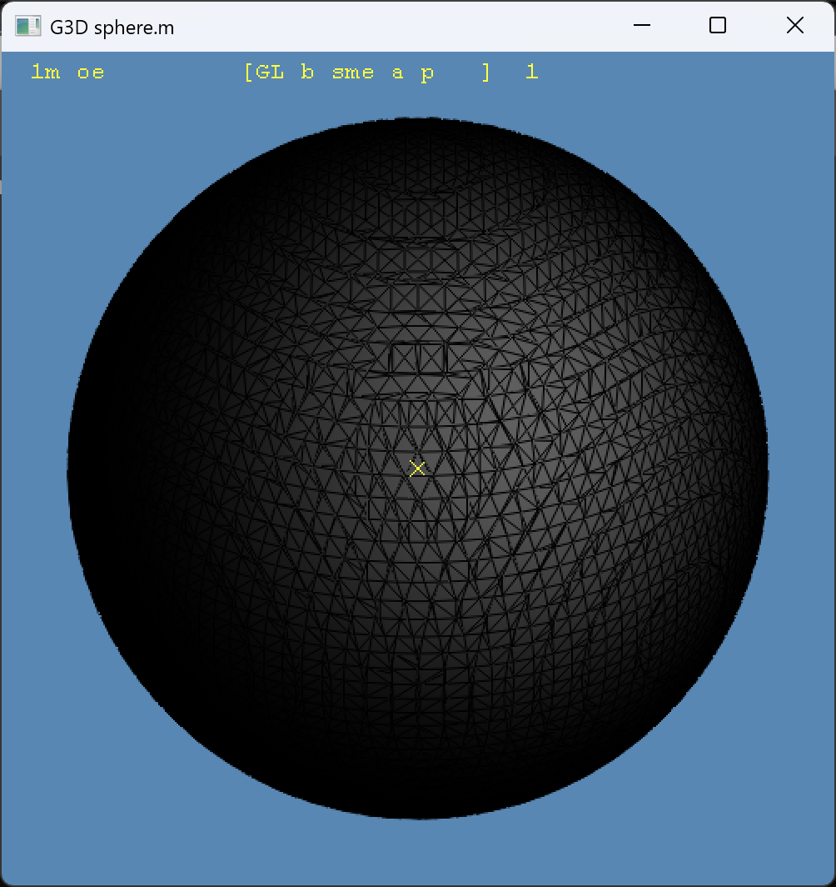

# 基于八叉树的裁剪网格生成

## 题目介绍

裁剪网格是从体素或隐式场中裁剪出一个等值面（等值曲面），并将这个曲面转化为可渲染的三角网格。更直观地说，在规则体素网格上，每个体元（cell）都有 8 个角点，我们希望用一个“曲面”去裁剪这些体元，得到曲面与体元边的交点，最后把这些交点组织成三角形面片，这就是裁剪网格。传统的 Marching Cubes（MC）与 Simplified Marching Cubes（SMC）正是解决这一问题的经典方法：MC 利用 256 种体元配置表生成三角片，SMC在此基础上将部分共面三角片进行合并，降低面片数量。

然而，直接在全分辨率体素网格上执行 MC/SMC 会带来两个问题：第一，模型中大量平面区域会产生非常密集且重复的小三角形；第二，体素分辨率很高时，整体面片数和内存开销过大。八叉树（BON/均等树变体）的引入是为了解决这两个问题。八叉树将空间划分成层次结构，使得“局部信息可以在树节点被概括”，当多个子体元的三角片属于同一平面时可以被父节点合并（shrink），从而以更少的超体元表示更大范围的平面区域。通过“先找边界体元，再八叉树合并，再抽取三角片”的策略，我们得到一种“生成时简化”的裁剪网格方法：既保留曲面边界的细节，又能显著减少平面区域的面片数量。

本报告实现的“基于八叉树的裁剪网格生成”包含以下关键思想：

- 体素扫描阶段仅保留边界体元（config != 0 && config != 255），将其作为八叉树叶子节点。
- 使用共面类型（NormalTypeId）与平面方程参数 D 作为 shrink 的一致性条件，确保合并后的超体元仍与原平面一致。
- 对单位体元使用 SMC 表（SMCTable）直接生成三角片，对超体元使用 MC 表（TriTable）结合平面方程交边生成三角片。
- 为保证连通性与稳定性，增加了角点配置一致性修正与边界点平滑，使深度较大时仍能输出整体连通的裁剪网格。

## 算法流程

1. 体素扫描与边界体元判定
   - 对每个体元 (x,y,z) 计算 8 个角点是否在实体内（inside/outside）。
   - 构造 8-bit 配置 `config`，仅保留 `config != 0` 且 `config != 255` 的体元。
   - 这是裁剪网格的核心：只有这些边界体元与曲面相交，才会生成三角片。

2. 八叉树插入（BON 思路）
   - 体元坐标转换成每层的 3-bit 索引（XYZ 对应 1/2/4）。
   - 沿着根到叶的路径逐层插入，缺失节点则创建。
   - 每个节点保存坐标范围 `[xmin,xmax]×[ymin,ymax]×[zmin,zmax]`，为后续抽取与合并提供空间信息。

3. 共面类型与平面方程参数计算
   - 对每个边界体元，根据 `config` 查表得到共面类型（NormalTypeId）和对应平面方程参数 D。
   - 平面方程使用 `Ax + By + Cz = D` 表示，A/B/C 取值范围有限，D 随体元坐标变化。
   - 这一阶段决定了哪些体元可以合并为更大的平面区域。

4. Shrink 合并
   - 自底向上检查节点的 8 个子节点。
   - 满足以下条件时合并为父节点：
     - 子节点都为共面类型（非 NormalNotSimple）；
     - 子节点的 NormalTypeId 完全一致；
     - 子节点的 D 完全一致。
   - 合并后父节点承载该平面信息，子节点被释放，完成“局部简化”。

5. 角点一致性修正（连通性增强）
   - 对边界体元的 8 个角点进行二次判定（多方向投票），减少 inside/outside 抖动。
   - 对边界角点进行邻域多数投票平滑，使相邻体元的角点状态保持一致。
   - 该步骤用来避免裂缝、叠面等常见问题，保证“深度越高仍尽量联通”。

6. 三角片抽取（单位体元与超体元）
   - 单位体元：直接使用 SMC 表，角点即为体素点，三角形连线固定且可枚举。
   - 超体元：先计算超体元配置，然后使用 MC 表，借助平面方程在边上求交点生成三角片。
   - 抽取时进行角点顺序重映射，保证与标准 MC 表一致（防止面反向与叠面）。

7. 结果输出与检查
   - 输出三角网格到 `.m`，统计顶点/面片数。
   - 重点检查：连通性（是否有裂缝）、面方向（是否反向）、平面区域是否简化成功。

## 关键代码展示

体元配置 `config` 的构造：

```cpp
unsigned char cfg = 0;
for (int pi = 0; pi < 8; ++pi)
{
  if (inside(x + dx[pi], y + dy[pi], z + dz[pi]))
    cfg |= (1 << pi);
}
if (cfg != 0 && cfg != 255)
  insert_leaf(x, y, z, cfg);
```

共面类型与平面参数计算：

```cpp
unsigned char eq = ConfigToEqType[cfg];
if (eq < EqTypeCount)
{
  Eq4 e = EqTypeToEqQuad[eq];
  D = e.d + e.a * x + e.b * y + e.c * z;
  NormalTypeId = ConfigToNormalTypeId[cfg];
}
```

Shrink 合并核心逻辑：

```cpp
bool can_merge(Node *node, int &D, int &normalType)
{
  for (child in node->children)
  {
    if (!child || child->invalid) return false;
    if (child->normalType == NOT_SIMPLE) return false;
    if (!init) { normalType = child->normalType; D = child->D; init = true; }
    if (child->normalType != normalType || child->D != D) return false;
  }
  return true;
}
```

角点顺序重映射（修正 MC 表顺序不一致）：

```cpp
unsigned char remap_cfg_to_mc(unsigned char cfg)
{
  unsigned char out = 0;
  for (int i = 0; i < 8; ++i)
    if (cfg & (1 << i)) out |= (1 << map[i]);
  return out;
}
```

超体元边交点计算：

```cpp
Point intersect_edge(BoxRange r, int edge, Normal n, int D)
{
  // 固定两坐标，解第三坐标，保证交点落在边上
  // 这里给出常见 12 条边的示例
  int x = 0, y = 0, z = 0;
  switch (edge)
  {
  case 0:  // (xmin, ymax+1, z)
    x = r.xmin; y = r.ymax + 1;
    z = (D - n.x * x - n.y * y) / n.z;
    break;
  case 2:  // (xmin, ymin, z)
    x = r.xmin; y = r.ymin;
    z = (D - n.x * x - n.y * y) / n.z;
    break;
  case 4:  // (xmax+1, ymax+1, z)
    x = r.xmax + 1; y = r.ymax + 1;
    z = (D - n.x * x - n.y * y) / n.z;
    break;
  case 6:  // (xmax+1, ymin, z)
    x = r.xmax + 1; y = r.ymin;
    z = (D - n.x * x - n.y * y) / n.z;
    break;
  case 8:  // (x, ymax+1, zmax+1)
    y = r.ymax + 1; z = r.zmax + 1;
    x = (D - n.y * y - n.z * z) / n.x;
    break;
  case 9:  // (x, ymax+1, zmin)
    y = r.ymax + 1; z = r.zmin;
    x = (D - n.y * y - n.z * z) / n.x;
    break;
  case 10: // (x, ymin, zmin)
    y = r.ymin; z = r.zmin;
    x = (D - n.y * y - n.z * z) / n.x;
    break;
  case 11: // (x, ymin, zmax+1)
    y = r.ymin; z = r.zmax + 1;
    x = (D - n.y * y - n.z * z) / n.x;
    break;
  case 1:  // (xmin, y, zmin)
    x = r.xmin; z = r.zmin;
    y = (D - n.x * x - n.z * z) / n.y;
    break;
  case 3:  // (xmin, y, zmax+1)
    x = r.xmin; z = r.zmax + 1;
    y = (D - n.x * x - n.z * z) / n.y;
    break;
  case 5:  // (xmax+1, y, zmin)
    x = r.xmax + 1; z = r.zmin;
    y = (D - n.x * x - n.z * z) / n.y;
    break;
  default: // (xmax+1, y, zmax+1)
    x = r.xmax + 1; z = r.zmax + 1;
    y = (D - n.x * x - n.z * z) / n.y;
    break;
  }
  return Point(x, y, z);
}
```

边界角点一致性修正（投票 + 平滑）：

```cpp
for each boundary cell:
  for each corner:
    state = vote(ray_x, ray_y, ray_z)
for each boundary vertex:
  state = majority(neighborhood)
```

## 可视化结果展示



## 总结分析

1. 该方法属于“生成时简化”：通过 shrink 合并减少三角片，而不是后处理削减。
2. 共面类型 + 平面方程 D 是合并的核心判据，确保大平面区域能被正确合并。
3. 单位体元用 SMC 表、超体元用 MC 表，是兼顾细节与简化的关键策略。
4. 角点顺序一致性是实际工程的“隐性瓶颈”，一旦顺序错误会出现大面积破面或叠面。
5. 为保证任意深度仍尽量连通，需要引入角点一致性修正与局部平滑，减少 inside/outside 抖动。
6. 该算法更适合包含大量平面区域的数据；在曲率很高或噪声很多的场景中，平面合并收益有限。

## 参考文献

1. Lorensen, W. E., Cline, H. E. Marching Cubes: A High Resolution 3D Surface Construction Algorithm. SIGGRAPH 1987.
2. Montani, C., Scateni, R., Scopigno, R. Discretized Marching Cubes. Graphics Interface 1994.
3. Chernyaev, E. V. Marching Cubes 33: Construction of Topologically Correct Isosurfaces. 1995.
4. chnhideyoshi. 基于八叉树的网格生成算法剖析. https://www.cnblogs.com/chnhideyoshi/p/OctreeBasedSimplifiedMarchingCubes.html
